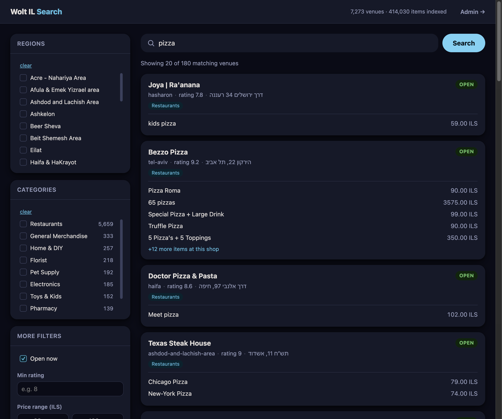
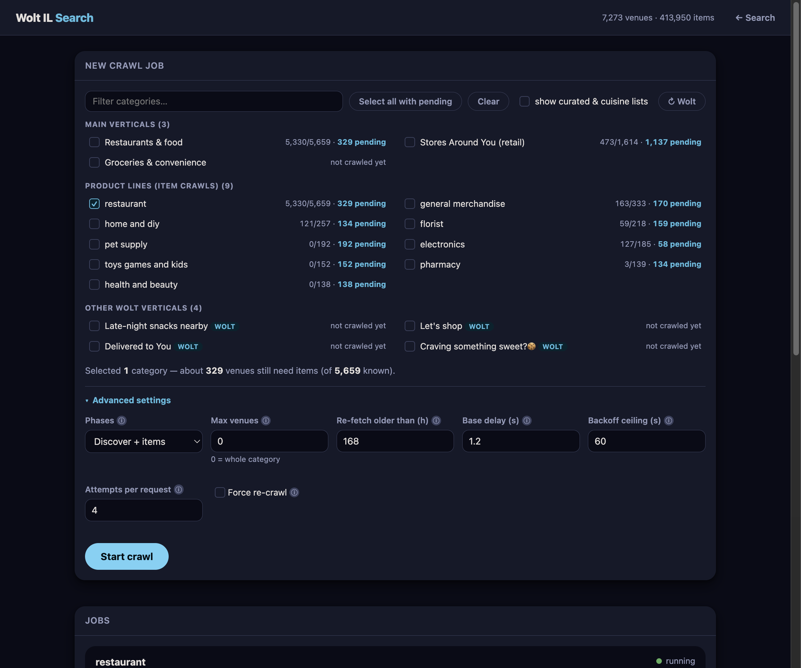
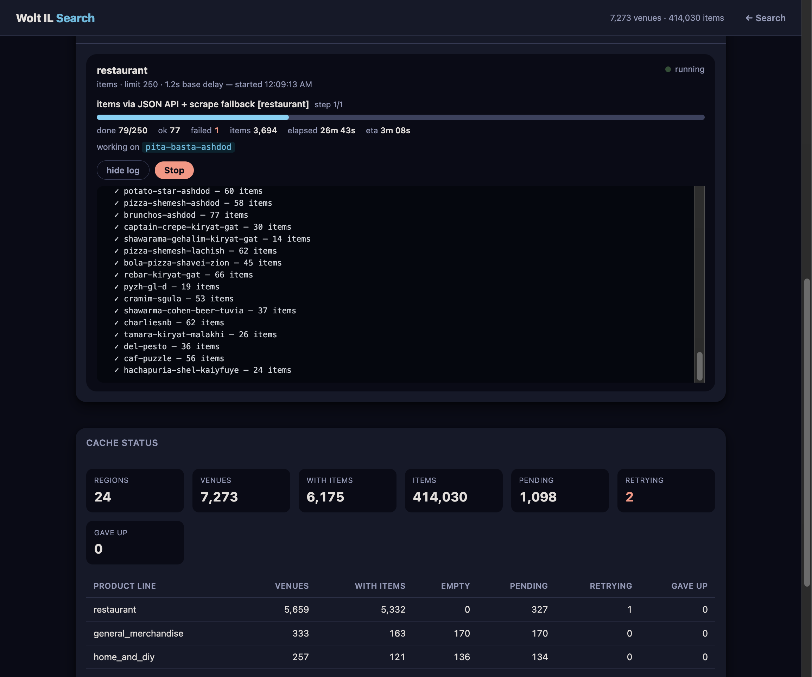

# wolt-il-search-mcp

Nationwide Israel search over Wolt, without ever touching an address field.



## Why this exists

Wolt's own search only looks at the one delivery region tied to your current
address, and its matching is picky (near-exact substrings, easily thrown off
by word order or typos). This project:

1. Crawls Wolt's public, unauthenticated consumer endpoints (the same ones
   wolt.com's web app calls — no API key exists for them) across **all 24 of
   Wolt's Israel delivery regions** (Tel Aviv, Jerusalem, Haifa, Beer Sheva,
   Eilat, etc. — pulled live from Wolt's own `/v1/cities`, not guessed).
2. Covers all three Wolt verticals: restaurants, retail (electronics,
   general merchandise, ...), and groceries/convenience (Wolt Market,
   AM:PM, ...) — Wolt organizes each under its own front-page section with
   no shared listing, so each needs its own crawl path.
3. Caches venues and full item catalogs locally in SQLite.
4. Runs real full-text search (SQLite FTS5 + BM25 ranking) over that local
   cache — instant, not scoped to any one region, and not thrown by word
   order the way Wolt's own in-app search is.
5. Exposes `search` and friends as MCP tools so you can just ask Claude things like
   *"find sushi places open right now in Haifa"*, *"who sells shakshuka near
   Jerusalem"*, or *"find a gaming laptop with an RTX 5070"*.

**Important — Wolt's ToS disallows automated access at scale.** This is
built for one personal user running an occasional, rate-limited, resumable
crawl — not a public scraping service. Keep `--delay` reasonable (1–2s+) and
don't run it continuously.

## Quick start (Docker)

```bash
docker compose up -d --build
```

That's it — a search + admin web UI is now at **http://localhost:8787/**
(bound to localhost only, on purpose — the admin API can start/stop crawl
jobs with no login, so `docker-compose.yml` publishes it as
`127.0.0.1:8787:8787` rather than to your whole LAN; change that line to
`8787:8787` if you actually want other devices on your network to reach it).
The cache starts empty (crawling is a deliberate, rate-limited step, not
something that happens automatically on container start — see "Building the
cache" below). Open **http://localhost:8787/admin**, tick the categories you
want (start with **Restaurants & food**, **Stores Around You**, and
**Groceries & convenience**) and press **Start crawl**. That's the whole
setup: the entire selection is crawled, so there's no venue count to guess
at. The first full run takes hours, but jobs run as background processes —
close the tab, come back later, the progress is still there.

The same thing from the API (which is exactly what the button calls):

```bash
curl -X POST localhost:8787/api/jobs -H 'Content-Type: application/json' \
  -d '{"categories": ["restaurants", "isr_retail_gm", "g_retail_groceries"]}'
```

`GET /api/categories` lists the valid keys; they're discovered from Wolt's own
front-page API, so new verticals appear in the picker without a code change.

The SQLite cache, its FTS5 index, and job logs all live in the `/data`
volume (`wolt-data` in `docker-compose.yml`), so `docker compose down` /
image rebuilds don't lose indexed data — only `docker compose down -v` does.

Tagged releases are also published as pre-built images to GitHub Container
Registry (see `.github/workflows/docker-release.yml`), so you can skip the
local build:

```bash
docker pull ghcr.io/danielvase/wolt-search:latest
docker run -p 127.0.0.1:8787:8787 -v wolt-data:/data ghcr.io/danielvase/wolt-search:latest
```

## Setup (without Docker)

```bash
cd ~/wolt-il-search-mcp
python3 -m venv .venv
.venv/bin/pip install -e .
.venv/bin/wolt-il-webui   # same web UI, defaults to http://127.0.0.1:8787/
```

## Building the cache

The venue lists are cheap (24 requests per vertical, one per region). Item
catalogs are **not** — restaurant menus are one HTTP request per venue
(~5,600+ restaurants nationwide); electronics/retail/grocery items are
several page fetches per venue (they use a different, heavier crawl — see
"How it works"). Because of that, crawling is a separate, resumable CLI
step — never something an MCP tool call triggers inline.

One command does all of it. `crawl` takes category keys, runs both phases
(discover venues, then fetch their items), picks the right item strategy per
category (JSON API, HTML scraper, or JSON-with-scrape-fallback), and reindexes
when it's done:

```bash
# What can I crawl? (discovered live from Wolt's front page, cached for a day)
.venv/bin/wolt-il-refresh categories

# One-time full build. No --limit means "all of it". Background it: hours on the first run.
nohup .venv/bin/wolt-il-refresh crawl \
  --categories restaurants,isr_retail_gm,g_retail_groceries > crawl.log 2>&1 &

# Or one vertical at a time, e.g. just the retail product lines that still need items:
.venv/bin/wolt-il-refresh crawl --categories pl:florist,pl:pet_supply,pl:pharmacy

# Rebuild the FTS5 index on its own (every crawl already does this at the end):
.venv/bin/wolt-il-refresh reindex
```

Useful flags: `--phases discover` or `--phases items` to run one half,
`--limit 25` for a quick test batch (`0`, the default, means no cap),
`--max-age-hours` to change what counts as stale, `--force` to ignore
freshness entirely, and `--progress json` to get the same NDJSON event stream
the admin UI consumes.

Retail venues whose catalog comes back empty from the JSON API are picked up
automatically by the HTML-scraper fallback inside the same run — no separate
rescrape command needed.

The older per-vertical subcommands (`regions`, `venues`, `retail-venues`,
`grocery-venues`, `menus`, `electronics-items`, `grocery-items`,
`retail-rescrape`, `full`) still work and still take `--limit`/`--max-age-hours`,
kept for existing scripts and cron entries.

Check progress any time:

```bash
.venv/bin/wolt-il-refresh status
# {'regions': 24, 'venues': 7273, 'venues_with_menu': 5979, 'menu_items': 402560,
#  'venues_pending': 1294, 'venues_retrying': 0, 'venues_gave_up': 0}
```

### Keeping it fresh

Venue lists change slowly; item catalogs change more often (prices, deals,
new items). Since `crawl` only touches venues that are actually stale, a
nightly run of the same command is enough — it re-discovers venue lists and
then works through whatever has aged past `--max-age-hours`:

```bash
# Nightly: refresh anything older than a week, capped so the run ends by morning
.venv/bin/wolt-il-refresh crawl \
  --categories restaurants,isr_retail_gm,g_retail_groceries \
  --max-age-hours 168 --limit 800

# Weekly: venue lists only, cheap
.venv/bin/wolt-il-refresh crawl --phases discover \
  --categories restaurants,isr_retail_gm,g_retail_groceries
```

A venue that fails transiently (429, 5xx, timeout) is retried on a per-venue
backoff and *not* marked fetched, so it comes back around on the next run
instead of being skipped for the whole staleness window. After 10 consecutive
failures it's parked and counted under "gave up" in the admin UI.

This is a good candidate for a nightly cron job / launchd job / Orca
automation.

## Web UI

`http://localhost:8787/` — free-text search with:
- Region + category checklists, open-now/min-rating/price-range filters, sort by relevance/rating/price
- **Faceted filtering computed from your actual results**: "Shops in these results" (click a shop once to require it, again to exclude it, again to clear) and "Item categories in these results" — both populate from what you searched, not a fixed list
- Every venue and item links out to the real wolt.com page
- Honest result counts ("Showing 20 of 1,131") with Load More pagination — nothing is silently capped
- Dark theme only, styled to match wolt.com's own production palette (`#009de0` brand blue, pure-black dark mode, pill-shaped buttons — pulled from wolt.com's actual CSS, not guessed)

`http://localhost:8787/admin` — one job creator plus a live list of jobs, so you never need a terminal to (re)build the cache:

- **Pick categories, press Start.** The category list is discovered from Wolt's front-page API (`/v1/pages/front`) and merged with whatever's already in your cache, so it reflects Wolt's actual verticals instead of a hardcoded list. Each row shows `with-items / known venues` and how many are still pending.
- **No venue cap to set.** A crawl covers the whole selection by default. Everything else — phase selection, a test-batch limit, staleness cutoff, base delay, backoff ceiling, retry attempts, force re-crawl — lives under **Advanced settings**, collapsed, because the defaults are what you want almost every time.
- **Live progress, not just a log**: current phase, a progress bar with `X/Y`, ok/failed/item counts, elapsed, ETA, and the venue being fetched right now. When the crawler is backing off it says so (`⏳ HTTP 429 — backing off 8.4s, pacing now 3.2s`) instead of looking frozen.
- **Up to 3 concurrent jobs**, each with its own optional log pane that tails incrementally and keeps your scroll position.
- **Cache status** broken down per product line: venues, with-items, `empty` (fetched fine but zero items — what the scrape fallback targets), pending, retrying, and gave-up counts.

Jobs are persisted to a `jobs` table, so restarting the webapp process re-attaches to any crawl that's still running and replays its log rather than orphaning it. (A Docker *container* restart still kills the crawl itself — it's a child process.)





## Using it standalone (no Claude needed)

```bash
.venv/bin/wolt-il-refresh search "hummus" --open --min-rating 8
.venv/bin/wolt-il-refresh search "burger" --region tel-aviv
```

## Registering the MCP server with Claude Code

Add to your project or `~/.claude.json` MCP config:

```json
{
  "mcpServers": {
    "wolt-il": {
      "command": "/Users/danielva/wolt-il-search-mcp/.venv/bin/wolt-il-search-mcp"
    }
  }
}
```

For Claude Desktop, add the same block to
`~/Library/Application Support/Claude/claude_desktop_config.json`.

### Tools exposed

| Tool | Description |
|---|---|
| `search` | Full-text search venues + menu items nationwide, from the local cache. Goes through the same `search_full()` entry point as the web UI, so it takes the same filters (`regions`, `product_lines`, `include_venues`, `exclude_venues`, `categories`, `min_price`/`max_price`, `min_rating`, `only_open`, `sort`) and returns the true `total` plus `offset`/`limit` for paging. |
| `list_regions` | The 24 Wolt Israel region slugs, for `search(regions=[...])`. |
| `cache_status` | Region/venue/item counts *and* the per-product-line breakdown, so a thin result set can be told apart from an uncrawled category. |
| `get_menu_live` | Live (uncached) menu fetch for one venue slug, for prices right before ordering. Reports whether a failure is permanent (wrong/dead slug) or transient. |

`search` also returns `venue_facets` and `category_facets`; feed those values
back in as `include_venues` / `categories` to drill down, the same way the web
UI's sidebar does.

## How it works under the hood

- `client.py` — raw HTTP calls to `consumer-api.wolt.com` (`/v1/cities`,
  `/v1/pages/restaurants?lat=&lon=&radius=`, `/v1/pages/venue-list/{target}`
  for the retail and grocery verticals, and the per-venue assortment
  endpoint), with rate limiting and retries via `backoff.py`.
- `backoff.py` — the retry/pacing layer shared by `client.py` and
  `retail_scraper.py`. Truncated exponential backoff with **equal jitter**
  (`delay/2 + random(0, delay/2)`): full jitter can return a near-zero wait
  immediately after a 429, and no jitter marches every retry in lockstep.
  `Retry-After` is honored when Wolt sends it. On top of that an AIMD
  adaptive throttle widens the inter-request gap multiplicatively on
  429/5xx and recovers it additively after 25 clean responses, so the crawl
  finds a sustainable rate on its own instead of relying on you to tune
  `--delay`. 4xx other than 429 is treated as permanent and never retried.
- `categories.py` — turns Wolt's front page into the crawlable category
  catalog the admin UI and `crawl` command share, so the vertical list isn't
  duplicated in three places.
- `retail_scraper.py` — electronics and grocery venues use
  `loading_strategy: "partial"`: their item data isn't in any JSON API
  response at all, only the category tree. The real items are embedded as
  server-rendered React Query state in the venue's category page HTML
  (`wolt.com/.../venue/{slug}/items/{category-slug}`) — this scrapes that.
- `cache.py` — SQLite storage (`~/.wolt-il-search/cache.db` by default),
  including `venues_fts`/`items_fts`: external-content FTS5 virtual tables
  (`unicode61` tokenizer, BM25 ranking with per-column weights favoring name
  over tags/description) kept in sync via `rebuild_search_index()` rather
  than triggers — cheap enough to just rebuild after each crawl batch.
- `indexer.py` — the crawls: regions → venues per region (all three
  verticals) → menus per restaurant venue → items per electronics/grocery
  venue (same HTML-scraper code path, just filtered by `product_line`).
- `search.py` — token-based search: each query token becomes an FTS5 prefix
  match (`token*`), tried as AND-across-tokens first (precision) and relaxed
  to OR if that finds nothing (recall), ranked by BM25 with small boosts for
  rating and open/closed status. This is why it doesn't have the old
  character-fuzzy-matching failure mode of technical/brand terms (e.g. "RTX",
  "SSD") coincidentally string-matching unrelated venue names — FTS5 only
  matches real shared tokens. A `rapidfuzz` character-similarity pass is kept
  as a fallback purely for typo tolerance, used only when the FTS5 pass finds
  nothing at all.
- `server.py` — the FastMCP server wrapping `search.py` + a live menu lookup.
- `webapp.py` — the FastAPI web UI (search + admin pages, HTML/CSS/JS embedded
  as strings, no separate frontend build step). Admin crawl jobs run as
  subprocesses of this server (`python -m wolt_il_search.cli crawl ...`) so a
  page reload doesn't kill them; their logs go to `$WOLT_IL_DB`'s directory
  under `job-logs/`, one file per job id. The child emits NDJSON progress
  events, a background thread folds them into live per-job state (so progress
  advances whether or not a browser is watching), and the job row is persisted
  so a webapp restart re-attaches by pid instead of losing the crawl.
  The admin page builds its DOM once and then patches `textContent` in place;
  it deliberately never reassigns `innerHTML` on a timer, which is what used
  to make the page flicker and drop input focus every 5 seconds.
- `Dockerfile` / `docker-compose.yml` — multi-stage build (build tools
  discarded from the final image), runs as a non-root user, cache lives on a
  named volume mounted at `/data` (`WOLT_IL_DB=/data/cache.db`).

Two deliberate findings baked into the design:
- Wolt scopes `/v1/pages/restaurants` results to one delivery region
  regardless of `radius` — a 60km radius from Tel Aviv returns the exact
  same venues as a 3km radius. There's no way to get nationwide coverage
  from a single query; you have to query once per region and merge, which is
  exactly what `indexer.py` does using the 24 region anchors from Wolt's own
  `/v1/cities`.
- The restaurant, retail, and grocery verticals are three separate
  front-page sections (`/v1/pages/restaurants` vs.
  `/v1/pages/venue-list/isr_retail_gm:{region}` vs.
  `/v1/pages/venue-list/g_retail_groceries:{region}`) with no shared
  listing — a crawl of one silently misses the others entirely, which is
  why venue discovery is parameterized by target
  (`refresh_venue_discovery()`) rather than assuming one listing endpoint. The grocery
  vertical isn't discoverable from `/v1/pages/restaurants` or
  `/v1/cities` at all — it only turned up by fetching Wolt's actual
  `/v1/pages/front` discovery endpoint (the one the web app itself calls
  to build its homepage) and diffing its section list against what this
  project already crawled. Note the target has no `isr_` prefix, unlike
  `isr_retail_gm` — `isr_g_retail_groceries` and `isr_retail_groceries`
  both 404; only the bare `g_retail_groceries` works.
